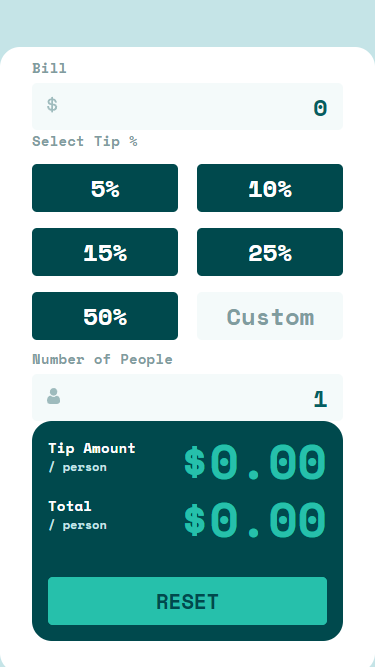

# Frontend Mentor - Tip calculator app solution

This is a solution to the [Tip calculator app challenge on Frontend Mentor](https://www.frontendmentor.io/challenges/tip-calculator-app-ugJNGbJUX). Frontend Mentor challenges help you improve your coding skills by building realistic projects.

## Table of contents

- [Overview](#overview)
  - [The challenge](#the-challenge)
  - [Screenshot](#screenshot)
  - [Links](#links)
- [My process](#my-process)
  - [Built with](#built-with)
  - [What I learned](#what-i-learned)
  - [Continued development](#continued-development)
- [Author](#author)

## Overview

### The challenge

Users should be able to:

- View the optimal layout for the app depending on their device's screen size
- See hover states for all interactive elements on the page
- Calculate the correct tip and total cost of the bill per person

### Screenshot




### Links

- Solution URL: [Add solution URL here](https://your-solution-url.com)
- Live Site URL: [Add live site URL here](https://your-live-site-url.com)

## My process

### Built with

- Semantic HTML5 markup
- CSS custom properties
- Flexbox
- CSS Grid
- JavaScript

### What I learned

Objetc:

```js
const regex = /^\d{0,4}(?:\.\d{0,2})?$/; // Allows only digits and a single decimal point
```

Methods :

```js
slice(); // The slice() method extracts a section of a string and returns it as a new string, without modifying the original string.
focus(); // The HTMLElement.focus() method sets focus on the specified element, if it can be focused. The focused element is the element that will receive keyboard and similar events by default.
setSelectionRange(); // The HTMLInputElement.setSelectionRange() method sets the start and end positions of the current text selection in an <input> or <textarea> element.
```

Functions :

```js
parseInt(string); // The parseInt() function parses a string argument and returns an integer of the specified radix (the base in mathematical numeral systems).
parseFloat(string); // The parseFloat function converts its first argument to a string, parses that string as a decimal number literal, then returns a number or NaN.
```

Properties :

```js
div.classList.add("anotherclass");
div.textContent. = "";
div.relatedTarget;
```

### Continued development

I spent a lot more time than expected on this challenge, while the formatting and calculation formula are rather simple and quick to code, so why? I started by putting style on my elements as I implemented features, so I lost a lot of time because the additions conflicted between them.

What I must remember:
Do things step by step, that is to first make the skeleton of my html, then put a little primary style to better visualize. Think carefully about all the features I want to implement on the model, in order to build a solid base for my javascript code. Finally, once everything is functional, finalize the implementation of the elements and the final style.

## Author

- Frontend Mentor - [@yourusername](https://www.frontendmentor.io/profile/Merlin033)
